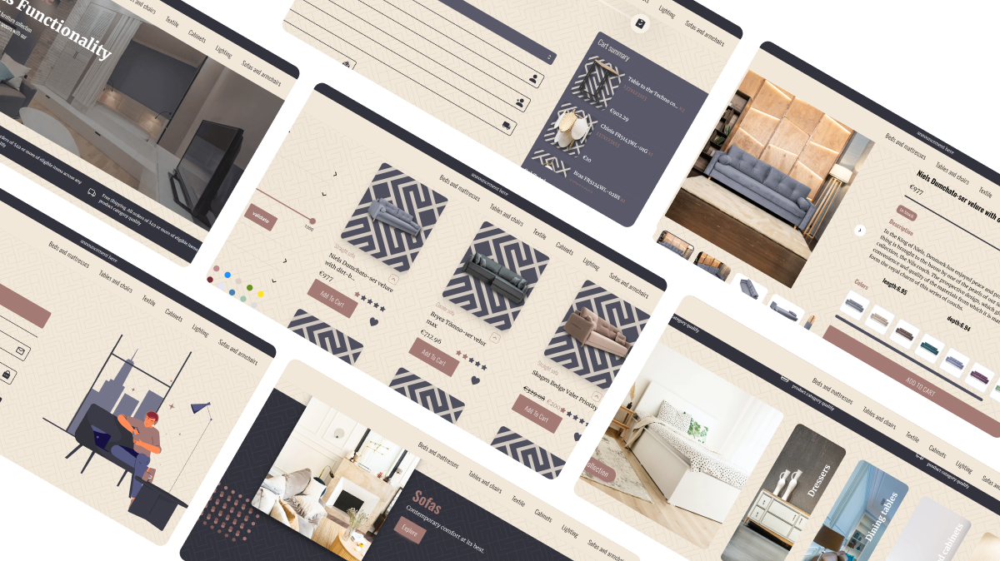

  

<h1 align="center">
  
  FurniWorld
 
</h1>

    
  
 

 

**E-commerce Furni World |** An online platform designed to provide a smooth and engaging shopping experience. Developed with Next.js and Express, this site features comprehensive product browsing, advanced filtering, and a responsive design. User authentication is secured with JWT.

  <a href="" target="_blank">View Demo</a>

## Built With
#### front End

     

  

### Backend End

   

## features

- 🔒 **Authentication System:** User login and registration using credentials and Google OAuth with NextAuth.

- 🌍 **Product Catalog:** Comprehensive product browsing experience with category-based navigation.

- 🔎 **Search and Filter:** Advanced filtering by prices, colors, sizes with sorting functionality.

- 🛋  **Detailed Product Pages:** Detailed product information with images, descriptions, and selectable options.

- 🛒 **Cart Management:** Easily manage cart items with add, remove, and update functionalities.

- ❤️ **Favorites and Reviews:** Mark products as favorites and provide ratings and reviews.

- 🎊 **Fully Responsive:** Ensures an optimal user experience on desktops, tablets, and mobile devices.

- 🚀 **High Performance:** Enhanced performance for quick page loads and efficient browsing.
